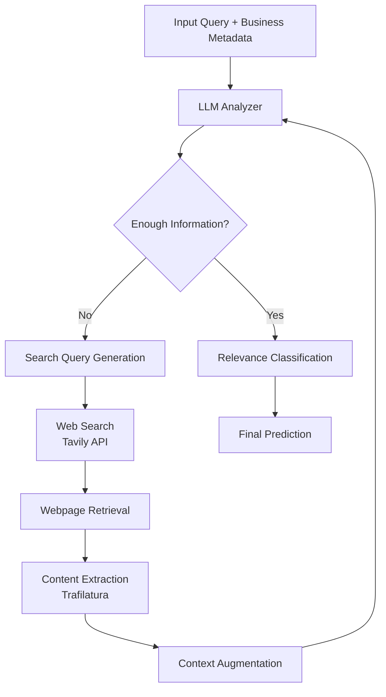

# LLM Agent for Business Relevance Classification (Yandex Maps)

An experimental project exploring whether **LLM agents with web search** can improve the relevance classification of businesses for complex category queries in map services.

The project compares a **Zero-shot LLM baseline** with an **agent-based architecture capable of retrieving external information from the web**.

Project developed during **Deep Learning School coursework**.

---

# Problem

Search systems for map services must determine whether a business is **relevant to a specific category query**.

Example:

```
query: "Milwaukee tool repair"
business: "City Power Tools Store"
```

The system must determine whether the organization actually provides the requested service.

Most datasets provide only limited metadata:

* business name
* address
* category
* assessor summaries (reviews, prices)

The hypothesis of this project:

> An LLM agent with access to web search may retrieve additional information about a business and improve classification accuracy.

---

# Approach

Two approaches were evaluated.

## 1. Baseline: Zero-shot Classification

A standard LLM classification pipeline without external tools.

**Input features**

* business name
* address
* category
* assessor summaries

**Models**

* `Qwen2.5-7B`
* final evaluation: `xiaomi/mimo-v2-flash`

**Baseline metrics**

| Metric   | Score  |
| -------- | ------ |
| Accuracy | ~0.627 |
| F1       | ~0.646 |

The baseline already performs reasonably well due to the quality of metadata provided in the dataset.

---

## 2. LLM Agent with Web Search

To improve performance, an **LLM agent** was implemented using **LangGraph**.

### Agent loop

```
Analysis → Search → Evaluation
```

1. The model analyzes available context.
2. If information is insufficient, it generates a **search query**.
3. Retrieves external data from the web.
4. Re-evaluates business relevance.


## Agent Architecture



### Tools

* **LangGraph** — agent orchestration
* **Tavily API** — web search
* **Trafilatura** — webpage text extraction

### Example

For ambiguous cases the agent may search for specific information:

```
"Does this store repair Milwaukee tools?"
```

or check whether the service appears on the company's website.

---

# Results

| Model    | Accuracy | F1     |
| -------- | -------- | ------ |
| Baseline | ~0.627   | ~0.646 |
| Agent    | 0.625    | 0.664  |

The agent architecture produced **only a small improvement (~1–2%)**.

---

# Analysis

Several factors explain the limited gain.

### Strong baseline

Assessor summaries already contain many key signals, leaving little room for improvement.

### Noisy web search

Search results often return:

* aggregators
* map listings
* duplicated information

These rarely provide new signals for classification.

### Lightweight evaluation model

The final evaluation used **flash-class models**, which have limited reasoning capabilities.

### Task characteristics

For most queries, **business name + category** are sufficient to determine relevance.

External search becomes useful only in **5–10% of edge cases**, limiting the potential metric improvement.

---

# Conclusion

The project demonstrates that:

* Well-designed **LLM zero-shot classification** can already perform strongly on enriched metadata.
* **Agent-based architectures** provide broader information access but may not always justify their additional complexity.
* Agents become most useful for **narrow queries requiring verification of specific services, brands, or price lists**.

---

# Tech Stack

* Python
* LangGraph
* Large Language Models (Qwen / MiMo)
* Tavily Search API
* Trafilatura

---

# Project Structure

```
project/
│
├── data_final_for_dls_new.jsonl         # dataset
├── baseline experiments (prompt, chain-of-thoughts, web-search)
├── agent experiments (langgraph, nodes, prompt)
├── AI_AGENT_KUDA_GO_v4                  # final pipeline
└── Отчет по проекту     # report (in Russian)
```

---

# Future Work

Possible improvements:

* stronger reasoning models
* better search query generation
* reranking retrieved sources
* structured knowledge sources for brands/services
